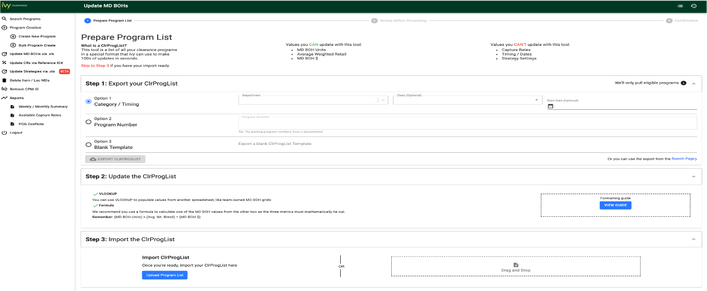

# Madhu’s Accomplishments

This document is the summary and background of my contribution at Target. Body of work include all mycontributions, created or facilitated technical documents across different projects, which were presented to the team and the leadership.

## Table of Contents

- [Madhulatha GV - Accomplishments](#Madhu’s-Accomplishments)
    - [Table of Contents](#table-of-contents)
    - [Skills worked](#skills-worked)
    - [Clearance Metrics](#Clearance-Metrics)
        - [Jira Stats](#Jira-Board)
        - [Git Stats](#Git)
    - [Clearance Major Contribution](#Clearance-Major-Contribution)
        - [UI Development](#UI-Development)
            - [Reusable Components](#Reusable-Components)
            - [Retail Calendar](#Retail-Calendar)
            - [Implement UI Analytics with Firefly - Greenfield, Harbinger](#Implement-UI-Analytics-with-Firefly---Greenfield-Harbinger)
            - [Migration from Angular to React](#Migration-from-Angular-to-React)
            - [Server Sent Events](#Server-Sent-Events)
            - [Excel Components](#Excel-Components)
            - [Responsive design](#Responsive-design)
            - [Bulk Updates](#Bulk-Updates)
                - [Timing Update](#Timing-Update)
                - [Copy to Digital](#Copy-to-Digital)
                - [BOH - Capture Rate - Strategy updates](#BOH---Capture-Rate---Strategy-updates)
                - [Bulk Capture Rates](#Bulk-Capture-Rates)
                - [Bulk Strategy Edits](#Bulk-Strategy-Edits)
                - [Digest Page](#Digest-Page)
        - [UI Source Code References](#UI-Source-Code-References)
        - [Backend Development](#Backend-Development)
    - [Mentorship - Team Contribution](#Mentorship---Team-Contribution)
    - [Core Data Services Contribution](#Core-Data-Services-Contribution)
        - [Reliability Scoring Matrix](#Reliability-Scoring-Matrix)
    - [Enterprise Contribution](#Enterprise-Contribution)
        - [Canvas UI](#Canvas-UI)
        - [Hackathon](#Hackathon)
        - [Patashala](#Patashala)
        - [WeCORE](#WeCORE)
        - [Ignite + Program](#Ignite-+-Program)
    - [Rewards and Recognitions](#Rewards-and-Recognitions)
    - [Confluence Documentation](#Confluence-Documentation)
    
 
 
## Skills Worked
- Programming/Scripting languages
    - HTMl
    - CSS
    - JavaScript
    - JQuery
    - Angular JS
    - React JS
    - Kendo UI
    - Mobile App Development (Hybrid)
- Datastore - Oracle
- CI/CD - Drone and Vela
    

## Clearance Metrics

   ### Jira Board

        - 2019 : 240 ( 125 Stories, 87 Defects)

        - 2020 : 195 ( 133 Stories, 42 Defects)

        - 2021 : 61 ( 52 Stories, 9 Defects)

   ### Git

        - 2019 (Jul to Dec) : 814 ( 546 Commits, 171 PR, 97 Code Reviews)

        - 2020 : 1501 ( 975 Commits, 361 PR, 165 Code Review)

        - 2021 : 270 ( 162 Commits, 62 PR, 46 Code Review)

## Clearance Major Contribution

### UI Development

#### Reusable Components 
To Ease the development, Reduce the application ui size and have faster delivery for less cost, Developed some of the below reusable components which are now being used across the application in multiple Instances/pages.

     https://git.target.com/clearance/clearance-client/tree/master/src/components/common

##### SILF Card 
This card would provide all details of program. It is used in Search, Bulk Features, Digest page.

##### Pagination
Pagination manages the resultant data and display page wise which serves both client-side and server-side pagination.

##### Excel components ( Read, Write ) 
This feature support user to select / drag & drop excel file and parse the data from excel by performing requiredvalidations.

##### Export / Download 
This component helps user to download the data in excel format by collecting few required inputs

##### Search 
This component is used to search the user input.

##### Progress Indicator 
This is configured at interceptor level which controls the display of progress bar during page load.

##### Tab Bar 
Tab bar allow navigation between groups of content that are related and at the same level of hierarchy.

#### Retail Calendar 
    https://git.target.com/clearance/clearance-client/tree/dev/src/components/common/calendar

- Retail calendar is normal calendar with retail-based events(4-4-5 Calendar).

- It is unique to the retail industry and has a particular way of laying out the year.

- The retail calendar is a calendaring scheme that was created to help retailers with sales comparability between years.

- It’s also an easy way to pinpoint important holidays and improve sales planning and projections around them.

- The calendar was initially developed in Angular with minimal options and later it was developed using React JS with advanced features like search for day, week, month and/or year to select dates by using smart textbox. It reveals option to filter dates with ONWARD, PRIOR, RANGE, EXACT date match.

##### Advantages
- Retail calendar is to set up in a way that lets users easily create/update/search clearance programs.

- It’s also an easy way to pinpoint important holidays and improve sales planning and projections around them.

- Sales Comparability between different dates/years.

##### Who Uses
Merchants/Planners/Analyst who create/update/search for programs in terms of retail week

#### Implement UI Analytics with Firefly - Greenfield, Harbinger 
    https://git.target.com/clearance/clearance-client/pull/1165

Implemented UI analytics with Harbinger in 2018 with limited features which were available. Migrated to Firefly with advanced features and have better traceability.

##### Purpose
To capture user actions/metrics, integrated UI application with Harbinger, firefly.

##### Advantages

- It focuses and track user events of the ui application.

- Helps to drive strategy and improve user experience.

- It helps to identify user action. It helps us to triage identify application error.

- Record of user activity and identify unique, active users

- Provides data to track and measure the feature usage

- Time spent in performing a task

- Application performance traceability by capturing API response time, Failures, UI Exceptions.

#### Migration from Angular to React

Initially we had built clearance UI with angular and it was cumbersome to perform real time updates on a page which has several details of a program. The performance of the application was going down. Angular 1 takes almost 5000ms, as compared to React, which takes under 1000ms.We chose to refactor as the complicated business logic, which AngularJS application was single-handedly juggling in the browser, to backend microservices.

##### Go Live Approach 
Initially Angular and react were 2 different apps where we used iframes and exposed it to users as a single application. We did not halt the development instead we developed new pages on react and used migrated features from angular app to react app.

##### Advantages
- Faster response time
- Light weight Application
- Scale up without significant changes to tooling, architecture, or development practices.

#### Server Sent Events

- In clearance multiple concurrent operations are performed and run-in background. To provide real time updates on the status of operations we use SSE. Events can handle 3 to 10 times more users than polling the server.
- This mechanism is used in stock exchange, news feed, sports etc.
- This was possible before, by polling the server to check if there were updates available and update the application. This slows down the application when used for longer hours. To overcome the performance issue SSE was introduced as the events flow in one way communication channel.

#### Excel Components

Built excel components to read/write/download excel. We have built a smart excel components which are easy to plug and use with minimal configurations

##### READ
Import excel by a click or drag & drop to read and parse the data with required validations.

##### WRITE
Component to write the bulk upload responses to excel and down the report

##### EXPORT/DOWNLOAD
Component is built with all the required configurations to export the Item/Location/Search result.

##### Advantage
These components reduces the 80% of development time which results in faster delivery.

###### Excel Component 

** **

###### Download

#### Responsive design

- Responsive design is a way to put together a website so that it automatically scales its content and elements to match the screen size on which it is viewed.
- It delivers best user experience.
- Users often work on multiple applications.
- They split screen with two applications open and compare data between applications.
- It helps users when applications are responsive. So that they can view the complete page at a glance without scrolling pages from top to bottom or left to right

###### Width <1100 Pixel 

** **

###### Width >1100 Pixel 

### Bulk Updates

Bulk updates let user edit multiple parameters for 100’s of program at once. This save user time. In order to provide better performance we have introduced options to update parameters in bulk.

##### Advantage
- Save User time.
- Better application performance.
-Reduce server calls which in turn results in cost reduction.

#### Timing Update

- User can set/extend/shorten the start date & program length in just 2 clicks.
- User can change date for 100 program with 3 clicks in a minute. To change the start date of 10 of programs user has to spend minimum of 15 mins.
- User has to navigate between program list and program page to update start date which is tiresome.
- Sending a batch of updates in one go, is faster than updating one by one and waiting for their response.

- Without timing update feature: 10 programs \* 90 seconds = 15mins

- With timing update: 10 program \* 3 clicks = 1.5minute

- This clarifies that 90% of users time is saved. This is an amazing performance improvement and users are pleased

#### Copy to Digital

- This feature enables an option to Clone store program to digital. Ideally user spends an average of 90seconds to create a program + 28 seconds to add items for a program = 118 seconds spent.
- Copy to Digital enables user to select 50+ store programs and clone the programs as digital with a button click.
- Without copy to digital : 50 programs \* 118 seconds = 1.38hrs
- With copy to digital : 50 programs \* 1 click = 2-3minutes

#### BOH - Capture Rate - Strategy updates

- BOH values are updated via excel. User updates the excel with the intended values and upload the file.

- UI application does a quick validation of the changes and provides a preview of updated programs.

- User can filter the errored programs and correct the values before the programs are processed which in turn save user time and results in user performant.

- Although these are 3 different options to update attributes according to user need.

- Reusable components like Excel components, Preview of the updated programs (SILF card), activity tracker and the digest page (success/failure tabs) saved a lot of development time for Bulk Features.

- All the mentioned components are used for bulk updates with minimal configurations.

###### BOH Bulk Updates

#### Bulk Capture Rates

###### Import Programs

** **

###### Review Program before processing

#### Bulk Strategy Edits 

###### Import Programs

** **

###### Review Program before processing

#### Digest Page

Digest page is common across all bulk updates. This provides results of bulk updates with success/failure.

### UI Source Code References 

- Built several Re-usable components in UI ( Retail Calendar, SILF Card, Pagination https://git.target.com/clearance/clearance-client/tree/master/src/components/common
- Implement UI Metrics with Firefly and Greenfields
    - Framework Upgrades https://git.target.com/clearance/clearance-client/pull/677
    - Responsive Design https://git.target.com/clearance/clearance-client/pull/671
    - Excel components ( Read , Write & Downloads )
- Server Sent Events https://git.target.com/clearance/clearance-client/pull/722
- Built architecture to support reusable Bulk Features as plug and play
    - Timing Updates https://git.target.com/clearance/clearance-client/pull/844
    - Copy to Digital https://git.target.com/clearance/clearance-client/pull/934
    - BOH Updates https://git.target.com/clearance/clearance-client/pull/1130
    - Capture Rate Updates (<https://git.target.com/clearance/clearance-client/pull/1024>)
    - Strategy Updates (<https://git.target.com/clearance/clearance-client/pull/1197>)
    - POG Conflicts/Item loc deletes (<https://git.target.com/clearance/clearance-client/pull/963>)
- Price Rec Review (<https://git.target.com/clearance/clearance-client/pull/1278>)

### Backend Development

- API to fetch program phases/status. https://git.target.com/clearance/cm-lookup-services/pull/34
- Worked on the activity tracker for item loc deletes in bulk https://git.target.com/clearance/cm-ivy-activity-api/pull/28
- Audit for forecast switch https://git.target.com/clearance/cm-program-api-v2/pull/323
- Bug fixes: Audit, program creation https://git.target.com/clearance/cm-ivy-audit-v1/pull/34
- ivy-events/pull/65 (https://git.target.com/clearance/cm-ivy-events/pull/65

### Mentorship - Team Contribution

- Mentored Gandhali, Supriya, Alankrutha effectively and helped them to evolve as strong individual contributors owning critical components.
- Coordinate with team on building features with end to end delivery.
- Advised team on solutions in case of any challenges faced
- Helped team with triaging and debugging issues and took it to closure
- Contributed in Clearance SME meetings from Offshore and advised on solutions for upcoming features
- Worked with UX Designer, PO collaboratively in all features and delivered successfully

## Core Data Services Contribution

### Reliability Scoring Matrix

- Developing UI Application to display the measurement and their respective weightage of different products across Core Data Services              
        https://git.target.com/MadhulathaGV/reliability-scoring-ui

## Enterprise Contribution

### Canvas UI

- Built Gregorian Calendar used in the international standard for Representation of dates
- Built Retail Calendar used to select retail weeks /days, so users doesn't have to translate from the Gregorian calendar to the Retail calendar.
- Coordinating with Merchandise team to help them contribute on Input Masking

### Hackathon

- UI contribution for hackathon 2020 on Ocpact (In-store digital experience for clearance)
- UI contribution for codered hackathon 2021 on End of Life Product (Solution to fix the large amounts of inventory from being stuck at stores and backroom)

### Patashala

- Presented session on topic “An Introduction to Canvas UI Framework”

### WeCORE

- Lead SHE CODES which builds products for WeCORE
- Owned in building Mentoring portal from end to end
- Lead SHE Speaks which conducts sessions across WeCORE
- Planned and coordinated Communication Lab Sessions
- Organize events/sessions across WeCORE
- Planned and Moderated Women’s Day Celebration.
- Planning for Mothers Day Celebration
- Mentor/Mentee program
- Mentoring team member ( Deepthi Jugali) on UI development.

### Ignite + Program

**Objective:**  Empower the girl students at Sir MVIT with a range of technical and personal development skills to make them well-rounded
- Conducted **Live Virtual Classroom** which is an interactive online **training** event engaged with a 30+students.
- Students had an opportunity to be active participants in the session and take part in real-time discussions and breakout exercises.

###### Feedback from Students

## Rewards and Recognitions

### Canvas
###### Received Below feedback on date picker rollout

### Patashala 

###### Received below award providing session on Canvas

### WeCORE 
###### Received below recognition on launching Mentor Portal

### Feedback

###### Received below feedback on women’s day

## Confluence Documentation

Below are few documentation links which i have contributed

- https://confluence.target.com/display/CDS/API+Contract

- https://confluence.target.com/pages/viewpage.action?pageId=174421593

- https://confluence.target.com/display/CPM/Bulk+Edit%3A+LRF+to+SRF+switch

- https://confluence.target.com/display/CPM/Bulk+Edit%3A+Constraints+and+Reasons

- https://confluence.target.com/display/CPM/Price+rec+review

- https://confluence.target.com/display/CPM/Bulk+Edit%3A+Strategy+validation+rules

- https://confluence.target.com/display/CDS/Mentors@Target+-+UI+Portal

- https://confluence.target.com/display/CDS/SheSpeaks+Communication+Lab

